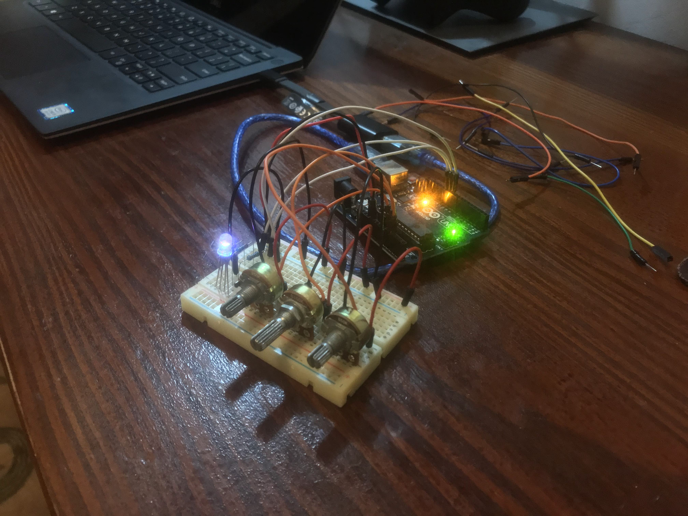

# Homework 1 - RGB LED

### Description

Control an RGB LES's colour using 3 potentiometers.

### Image

_pls notice, now I've got a cable_

### Video

<iframe width="100%" height="500" src="https://www.youtube.com/embed/DEQoQUy8244" title="YouTube video player" frameborder="0" allow="accelerometer; autoplay; clipboard-write; encrypted-media; gyroscope; picture-in-picture" allowfullscreen></iframe>
