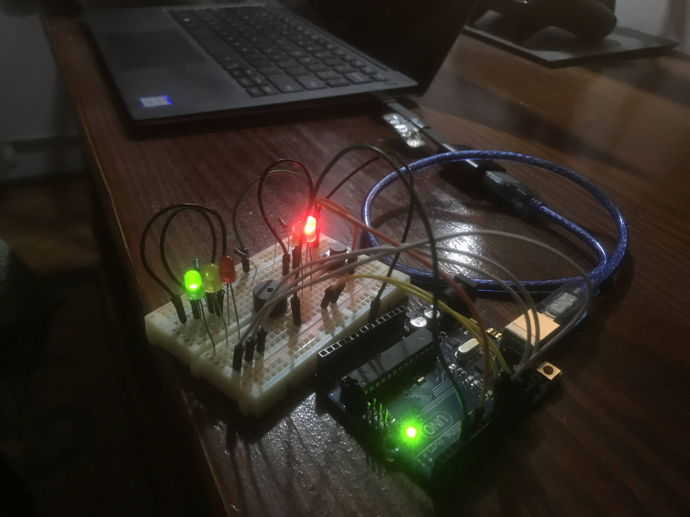

# Homework 2 - Semaphore

### Description

Simulate the behaviour of traffic lights for a cross walk.

States:
1. Press the button to begin the cycle
2. Wait 10 seconds
3. Traffic lights changes to Yellow
4. Wait 3 seconds
5. Traffic lights change to Red and cross walk lights change to green.
   You can hear a constant buzzing noise.
6. This state lasts 10 seconds. You can cross the street.
7. The green light starts to blink. You can hear [Shave and a haircut to bits](https://youtu.be/w8FqML_b6og?t=58).
   You need to hurry! You've got about 5 seconds until doom!!
8. After 2 bits (about 5 seconds) the cross walk light turns to red 
   and the traffic lights back to green.

### Image

_pls notice, I didn't burn it this time_

### Video

<a href="https://youtu.be/9aiNRyrmK6k" target="_blank">
  </img>
</a>
