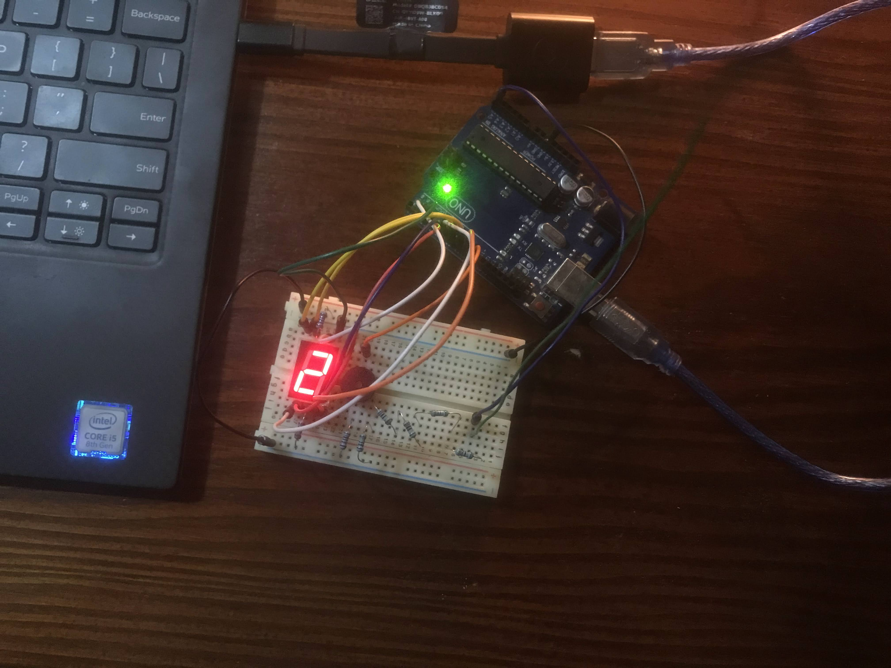

# Homework 2 - Semaphore

### Description

Use a wire antenna to detect the nearby electro-magnetic field. 
Or, as it's known in pop culture, detect ghosts.

Display the fluctuations on a 7-segment display and play a corresponding tone
using a buzzer.

I used 5 x 1M ohms resistors connected to the antenna to reduce the noise 
as much as possible.

### Image

_pls notice, I'm ghost_

### Video

<a href="https://youtu.be/kdNrV8vLxoE" target="_blank">
  </img>
</a>
