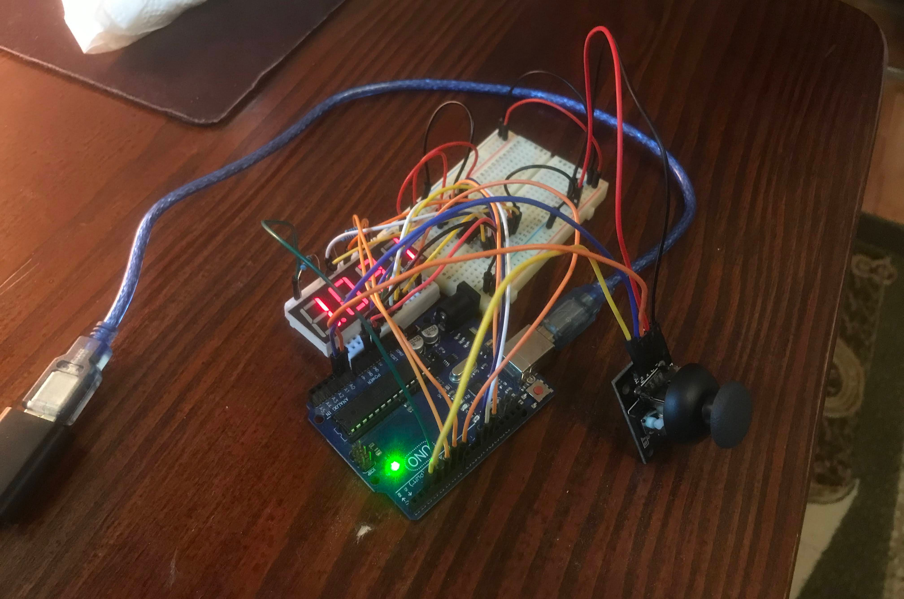

# Homework 4 - Four Digits Digital Switcher

### Description

Cycle through digits on a 4-digit 7-segment display and change
them using a joystick. To avoid using too many pins on the arduino,
the display is connected and controlled via a **shift register**.

##### Behaviour

* In the first state you can cycle through the digits by tilting the joystick
  left or right. The blinking dot indicated the current digit
* When pressing the button we switch to the second state. Locked in on a digit,
  tilting the joystick up and down we increment or decrement the digit's value.
  When pressing the button again the value is saved and we return to the first state.
* Values are saved in eeprom, so on a reset, the last saved value is loaded.

### Image

_pls notice, the spagetti is upon us_

### Video

